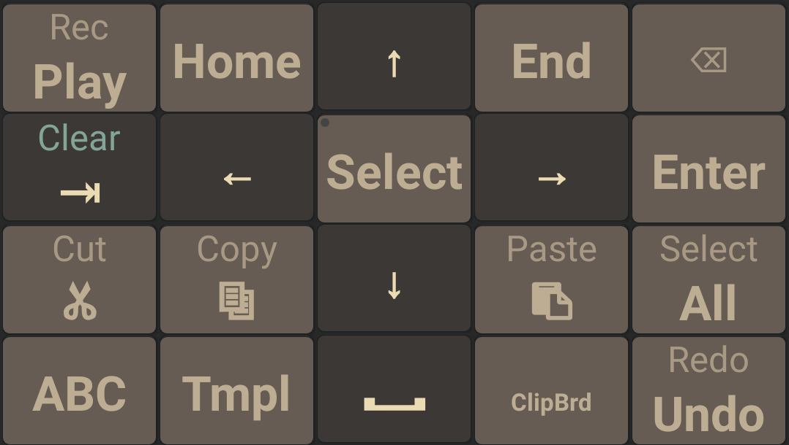

# 4row ortholinear keyboard
 Config for Jbak2 Keyboard with ortholinear 4 row layout for russian and english languages.

## Скриншоты

## Особенности

* Сетка 4*10 без стагера.
* Сетка не меняется при смене языка.
* Кирилическая раскладка ЙБУКЕН.
* Убран нижний ряд, пробел перенесен в буквенный ряд
* Backspace перенесен во второй ряд
* Спец символы вызываются удержанием, они расположены на манер расположения на обычной компьютерной клавиатуре.
* Цветовая тема в стиле [gruvbox dark](https://github.com/morhetz/gruvbox).
* Переработан слой для редактирования текста.
* Некоторые функции вызываются жестами.

en_qwerty_4row_v2 отсутствует в силу невозможности разместить Backspace во втором ряду.

## Установка

1) Скачиваем и устанавливаем [Jbak2 keyboard](https://4pda.ru/forum/index.php?showtopic=638021).
2) Копируем склонированные из репозитория папки и файлы в /storage/emulated/0/jbak2Keyboard.
3) Запускаем Jbak2 Keyboard и проводим первоначальную настройку.
4) Jbak2 Keyboard > Резервирование настроек > Загрузить настройки > Да.

## Автозамена (v8)

| Исходный текст | Автозамена |
|----------------|------------|
| ЫЫ             | Ю          | 
| ЬЬ             | Ъ          | 
| ШШ             | Щ          | 
| ЙЙ             | Э          | 
| ЧЧ             | Ф          | 
| ХХ             | Ц          | 
| ⎵⎵             | .⎵         | 
| --             | —          | 

## Жесты (v8)

|  Жест              | Действие                     |
|--------------------|------------------------------|
| Слева на право     | Раскладка для редактирования |
| Справа на лево     | Переключение языка           |
| От Backspace влево | Удалить слово                |
| Снизу вверх        | Shift                        |
| Сверху вниз        | Enter                        |
